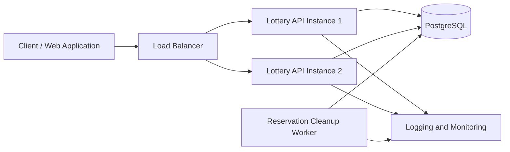
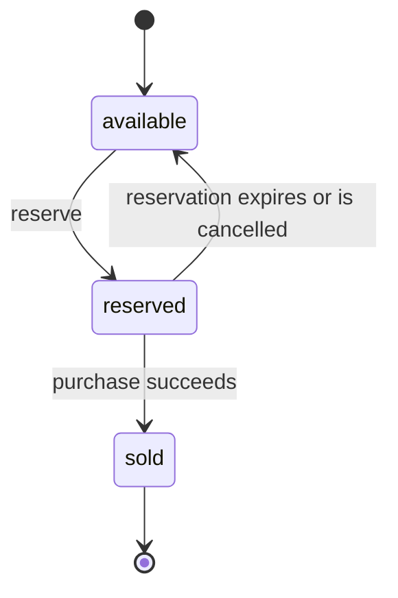

# Lottery Search System Design

[ภาษาไทย](./lottery-search-system.th.md)

## 1. Overview

This document proposes a production-ready design for searching and allocating lottery tickets from a dataset of more than 10 million records.

Each ticket contains a six-digit lottery number. Users can search using an exact six-character pattern containing digits and wildcard characters (`*`).

Example patterns:

| Pattern  | Description                                    |
| -------- | ---------------------------------------------- |
| `****23` | Any number ending in `23`                      |
| `1****5` | Any number starting with `1` and ending in `5` |
| `123***` | Any number starting with `123`                 |

The system must provide efficient wildcard searches and prevent the same ticket from being allocated to multiple users at the same time.

## 2. Scope and Assumptions

The following assumptions are used in this design:

1. Each ticket has a unique `ticket_id`.
2. A lottery number is stored as a six-character string so that leading zeros, such as `001234`, are preserved.
3. Different tickets may have the same six-digit lottery number.
4. A search pattern must contain exactly six characters.
5. Each character must be either a digit from `0` to `9` or a wildcard (`*`).
6. Only tickets with an `available` status can be returned.
7. Searching and reserving tickets are handled as one operation to prevent duplicate allocation.
8. A reservation is temporary and has an expiration time.
9. An expired reservation makes the ticket available again.
10. The number of tickets returned per request is limited and configurable.

## 3. Proposed Architecture



The initial architecture uses PostgreSQL as the single source of truth for ticket availability, reservations, and purchases.

The Lottery API is stateless and can run as multiple instances behind a load balancer. PostgreSQL transactions and row-level locking ensure that multiple API instances cannot allocate the same ticket at the same time.

### 3.1 Client

The client sends a six-character search pattern and the number of tickets required.

Example request:

```json
{
  "pattern": "****23",
  "limit": 5
}
```

The authenticated user ID must be obtained from a trusted session or access token. The API must not trust a user ID supplied directly in the request body.

### 3.2 Load Balancer

The load balancer distributes incoming requests across multiple Lottery API instances.

Since the API is stateless, any instance can process a request. Additional instances can be added when traffic increases.

### 3.3 Lottery API

The Lottery API is responsible for:

1. Validating that the search pattern contains exactly six characters.
2. Validating that each character is a digit or a wildcard (`*`).
3. Validating and limiting the number of requested tickets.
4. Starting a PostgreSQL transaction.
5. Finding available tickets matching the search pattern.
6. Locking the selected ticket rows.
7. Changing the selected tickets from `available` to `reserved`.
8. Setting the reservation owner and expiration time.
9. Committing the transaction.
10. Returning only the tickets that were successfully reserved.

Searching and reserving tickets must be completed within the same database transaction.

A simplified request flow is:

```text
Client request
→ validate pattern and limit
→ begin PostgreSQL transaction
→ find and lock matching available tickets
→ update tickets to reserved
→ commit transaction
→ return reserved tickets
```

### 3.4 PostgreSQL

PostgreSQL stores:

- Ticket ID
- Six-digit lottery number
- Current ticket status
- Reservation owner
- Reservation expiration time
- Ticket creation and update timestamps

PostgreSQL is the final authority for determining whether a ticket is available.

All ticket allocation operations must use the primary database because the allocation process requires current and strongly consistent data.

### 3.5 Reservation Cleanup Worker

A dedicated background worker runs once immediately after startup and then starts a cleanup cycle every one minute. Each cycle finds expired reservations and changes the associated tickets from `reserved` back to `available`.

Before releasing a ticket, the worker must verify that:

- The ticket is still in the `reserved` status
- The reservation expiration time has passed
- The reservation has not been extended
- The ticket has not already been purchased

The worker processes expired reservations in batches of 1,000 records. It runs multiple batches continuously within the same cleanup cycle until no expired reservation remains. For example, 50,000 expired reservations require 50 consecutive batches in one cycle, not 50 one-minute cycles.

Each batch uses a separate short transaction to avoid long-running transactions and excessive row locking. User-initiated cancellation releases a ticket immediately and does not wait for the cleanup worker.

### 3.6 Logging and Monitoring

The API and background worker should record logs and metrics for:

- Request latency
- Database query latency
- Search pattern type
- Number of tickets requested
- Number of tickets successfully reserved
- Allocation failures
- Database lock contention
- Expired reservations released
- Available ticket count
- API and database error rates

These metrics help identify performance bottlenecks and determine whether additional optimization is required.

## 4. Database Selection

### 4.1 Recommended Database: PostgreSQL

PostgreSQL is selected as the primary production database and the source of truth for this system.

The main reasons are:

1. **Strong transactions**  
   Searching, locking, and reserving tickets can be completed within one transaction.

2. **Row-level locking**  
   PostgreSQL can lock only the selected ticket rows instead of locking the entire table.

3. **`FOR UPDATE SKIP LOCKED` support**  
   If a ticket is already locked by another transaction, a concurrent request can skip it and continue searching for another available ticket.

4. **Atomic state changes**  
   A ticket can be changed from `available` to `reserved` only when it is still available.

5. **Index support**  
   PostgreSQL supports B-tree indexes, composite indexes, and partial indexes.

6. **Operational simplicity**  
   Ticket information and reservation state are stored in one authoritative database, reducing synchronization complexity.

7. **Suitable scale**  
   PostgreSQL can support more than 10 million ticket records when the schema, indexes, and queries are designed appropriately.

### 4.2 Concurrent Allocation

Multiple API instances may attempt to allocate matching tickets at the same time.

PostgreSQL handles this by locking the selected rows inside a transaction. A request uses `FOR UPDATE SKIP LOCKED` to avoid waiting for tickets already being processed by another request.

The expected behavior is:

```text
User A
→ locks ticket T001
→ changes T001 to reserved
→ receives T001

User B at the same time
→ skips locked ticket T001
→ locks another available ticket
→ receives a different ticket
```

This prevents the same `ticket_id` from being allocated to multiple users at the same time.

Different tickets may still have the same six-digit number. For example:

```text
T001 → 123423
T002 → 123423
```

Both tickets can be allocated because they have different `ticket_id` values.

### 4.3 Primary Database Usage

Search and allocation requests are sent to the primary PostgreSQL database.

A read replica should not be used for allocation decisions because replication delay may cause a replica to report a ticket as available after it has already been reserved on the primary database.

Read replicas may be considered in the future for non-critical reporting or analytics that can tolerate slightly stale data.

### 4.4 Future Consideration: Redis

Redis was considered as a possible future optimization for:

- API rate limiting
- Caching non-critical data
- Caching search metadata
- Reducing repeated reads that are proven to be performance bottlenecks

Redis is not included in the initial ticket allocation flow.

PostgreSQL already provides the transactions and row-level locking required to prevent duplicate allocation. Adding Redis before identifying a measured performance problem would introduce additional infrastructure and data consistency concerns.

If Redis is introduced later, PostgreSQL will remain the source of truth. Every final ticket allocation must still be validated and committed atomically in PostgreSQL.

## 5. Data Model

### 5.1 Ticket Table

The `tickets` table stores each individual lottery ticket and its current allocation state.

A proposed schema is:

```sql
CREATE TYPE ticket_status AS ENUM (
    'available',
    'reserved',
    'sold'
);

CREATE TABLE tickets (
    ticket_id BIGSERIAL PRIMARY KEY,
    number CHAR(6) NOT NULL,

    digit_1 SMALLINT NOT NULL,
    digit_2 SMALLINT NOT NULL,
    digit_3 SMALLINT NOT NULL,
    digit_4 SMALLINT NOT NULL,
    digit_5 SMALLINT NOT NULL,
    digit_6 SMALLINT NOT NULL,

    status ticket_status NOT NULL DEFAULT 'available',

    reserved_by UUID,
    reserved_until TIMESTAMPTZ,

    sold_to UUID,
    sold_at TIMESTAMPTZ,

    created_at TIMESTAMPTZ NOT NULL DEFAULT NOW(),
    updated_at TIMESTAMPTZ NOT NULL DEFAULT NOW(),

    CHECK (number ~ '^[0-9]{6}$'),
    CHECK (digit_1 BETWEEN 0 AND 9),
    CHECK (digit_2 BETWEEN 0 AND 9),
    CHECK (digit_3 BETWEEN 0 AND 9),
    CHECK (digit_4 BETWEEN 0 AND 9),
    CHECK (digit_5 BETWEEN 0 AND 9),
    CHECK (digit_6 BETWEEN 0 AND 9)
);
```

The lottery number is stored as `CHAR(6)` instead of an integer so that leading zeros are preserved.

For example:

```text
001234
```

must remain `001234` and must not become `1234`.

Each digit is also stored in a separate column. These positional columns make wildcard searches more index-friendly.

For example, the pattern:

```text
1**4*6
```

can be converted to:

```sql
WHERE digit_1 = 1
  AND digit_4 = 4
  AND digit_6 = 6
```

### 5.2 Ticket Status

A ticket moves through the following states:



The statuses have the following meanings:

| Status      | Meaning                                                        |
| ----------- | -------------------------------------------------------------- |
| `available` | The ticket can be searched and allocated                       |
| `reserved`  | The ticket is temporarily held by a user                       |
| `sold`      | The purchase is complete and the ticket is no longer available |

When a ticket is `reserved`, `reserved_by` and `reserved_until` must be populated.

When the purchase succeeds, the ticket changes to `sold`, and `sold_to` and `sold_at` are populated.

### 5.3 Data Consistency Rules

The application must maintain the following rules:

1. `number` must always contain exactly six digits.
2. `digit_1` through `digit_6` must match the corresponding positions in `number`.
3. An `available` ticket must not have an active reservation.
4. A `reserved` ticket must have `reserved_by` and `reserved_until`.
5. A `sold` ticket cannot return to `available`.
6. Different tickets may have the same lottery number because `ticket_id` identifies the individual ticket.

In a production implementation, the digit columns may be generated automatically from `number` or populated by a controlled ticket import process to prevent inconsistent values.

## 6. Indexing Strategy

A normal B-tree index on the complete `number` is useful for exact matches and prefix searches, but it is not sufficient for arbitrary wildcard patterns.

For example:

```text
123*** → can use a prefix index efficiently
***456 → cannot efficiently use a normal leading B-tree index
1**4*6 → fixes digits in different positions
```

The proposed design uses positional digit columns and partial indexes for available tickets.

### 6.1 Available Ticket Index

```sql
CREATE INDEX idx_tickets_available
ON tickets (ticket_id)
WHERE status = 'available';
```

This index supports patterns containing only wildcards, such as:

```text
******
```

It also allows the system to quickly find a small number of available tickets without scanning sold or reserved records.

### 6.2 Exact and Prefix Number Index

```sql
CREATE INDEX idx_tickets_available_number
ON tickets (number, ticket_id)
WHERE status = 'available';
```

This index supports:

- Exact number searches such as `123456`
- Prefix patterns such as `123***`
- Selecting only currently available tickets

A B-tree index on `number` is ordered from left to right. It can efficiently locate an exact value or a continuous range sharing the same prefix, such as `123000` through `123999`.

However, it is not efficient for a suffix pattern such as `****23`, which would normally become `number LIKE '%23'`. Since the leftmost digits are unknown, matching values are scattered throughout the index and PostgreSQL cannot seek directly to one continuous index range.

Suffix and arbitrary-position wildcard patterns therefore use the positional digit indexes described below.

### 6.3 Positional Digit Indexes

```sql
CREATE INDEX idx_tickets_available_digit_1
ON tickets (digit_1, ticket_id)
WHERE status = 'available';

CREATE INDEX idx_tickets_available_digit_2
ON tickets (digit_2, ticket_id)
WHERE status = 'available';

CREATE INDEX idx_tickets_available_digit_3
ON tickets (digit_3, ticket_id)
WHERE status = 'available';

CREATE INDEX idx_tickets_available_digit_4
ON tickets (digit_4, ticket_id)
WHERE status = 'available';

CREATE INDEX idx_tickets_available_digit_5
ON tickets (digit_5, ticket_id)
WHERE status = 'available';

CREATE INDEX idx_tickets_available_digit_6
ON tickets (digit_6, ticket_id)
WHERE status = 'available';
```

Depending on the data and pattern selectivity, the PostgreSQL Query Planner may use one positional index or combine multiple indexes. The actual plan is not guaranteed, so it must be checked with `EXPLAIN ANALYZE` using production-like data.

Positional digit indexes are preferred for suffixes and arbitrary wildcard positions because the API can convert every fixed character into an equality condition on a known column.

For example:

```text
****23
```

becomes:

```sql
WHERE status = 'available'
  AND digit_5 = 2
  AND digit_6 = 3
```

This avoids a leading-wildcard condition such as `number LIKE '%23'` and allows PostgreSQL to use the indexes for positions 5 and 6.

For example, the pattern:

```text
1****5
```

becomes:

```sql
WHERE status = 'available'
  AND digit_1 = 1
  AND digit_6 = 5
```

PostgreSQL can use the indexes on `digit_1` and `digit_6` together instead of scanning all ticket records.

### 6.4 Reservation Expiration Index

```sql
CREATE INDEX idx_tickets_expired_reservations
ON tickets (reserved_until, ticket_id)
WHERE status = 'reserved';
```

This index allows the cleanup worker to find expired reservations efficiently:

```sql
WHERE status = 'reserved'
  AND reserved_until < NOW()
```

### 6.5 Index Trade-offs

Indexes improve read performance but increase:

- Storage usage
- Ticket import time
- Update cost when a ticket changes status
- The need to monitor whether each index is actually used

PostgreSQL automatically updates the affected indexes when a ticket is inserted or its status changes. The application does not update indexes manually. However, the team should monitor index size, write performance, and query plans. An unused or duplicate index should be removed because it consumes storage and adds work to every related insert or update.

The system should not create an index for every possible wildcard combination. Six wildcard positions produce many possible combinations, and indexing every combination would create unnecessary storage and write overhead.

The proposed positional indexes provide a practical starting point. Actual production indexes should be reviewed using real search traffic, index usage metrics, and PostgreSQL `EXPLAIN ANALYZE`.

## 7. Wildcard Search Algorithm

### 7.1 Pattern Validation

The API validates the pattern before querying the database.

A valid pattern must:

1. Contain exactly six characters.
2. Contain only digits from `0` to `9` or wildcard characters (`*`).
3. Contain no spaces or other special characters.

Examples:

| Pattern | Valid | Reason |
| ------- | ----: | ------ |
| `****23` | Yes | Six valid characters |
| `123456` | Yes | Exact six-digit number |
| `******` | Yes | All positions are wildcards |
| `12345` | No | Only five characters |
| `1234567` | No | More than six characters |
| `12A***` | No | Contains an unsupported character |

Pattern validation takes constant time because the system always checks exactly six positions.

### 7.2 Pattern Conversion

The API examines each character in the pattern. A digit becomes a condition on the corresponding digit column, while a wildcard produces no condition for that position.

For example:

```text
Pattern: 1**4*6
```

becomes:

```sql
WHERE status = 'available'
  AND digit_1 = $1
  AND digit_4 = $2
  AND digit_6 = $3
```

Values must be passed as query parameters. User input must never be directly concatenated into SQL.

### 7.3 Example Pattern Conversions

| Input Pattern | Database Conditions |
| ------------- | ------------------- |
| `123456` | `number = '123456'` |
| `123***` | `number LIKE '123%'` or positional digit conditions |
| `****23` | `digit_5 = 2 AND digit_6 = 3` |
| `1****5` | `digit_1 = 1 AND digit_6 = 5` |
| `******` | No digit condition; filter only by `status = 'available'` |

Exact and prefix patterns can use the indexed `number` column. Patterns with wildcards in arbitrary positions use the positional digit columns.

### 7.4 Result Limit

Every request must have a result limit. A reasonable initial policy is:

```text
Default limit: 10
Maximum limit: 100
```

The API rejects zero or negative limits. If fewer tickets are available than requested, it returns only the tickets that were successfully reserved instead of failing the entire request.

## 8. Atomic Ticket Allocation

### 8.1 Search and Reserve Transaction

Searching and reserving tickets are performed in one PostgreSQL transaction.

The following SQL illustrates the allocation process for the pattern `****23`:

```sql
BEGIN;

WITH selected_tickets AS (
    SELECT ticket_id
    FROM tickets
    WHERE status = 'available'
      AND digit_5 = 2
      AND digit_6 = 3
    ORDER BY ticket_id
    FOR UPDATE SKIP LOCKED
    LIMIT 5
)
UPDATE tickets AS t
SET
    status = 'reserved',
    reserved_by = $1,
    reserved_until = NOW() + INTERVAL '5 minutes',
    updated_at = NOW()
FROM selected_tickets AS selected
WHERE t.ticket_id = selected.ticket_id
  AND t.status = 'available'
RETURNING
    t.ticket_id,
    t.number,
    t.status,
    t.reserved_by,
    t.reserved_until;

COMMIT;
```

This operation finds matching available tickets, locks the selected rows, skips rows already locked by another transaction, updates the selected tickets to `reserved`, and returns only the tickets successfully reserved for the authenticated user.

### 8.2 Concurrent Request Example

Assume the following tickets are available:

```text
T001 -> 123423
T002 -> 555523
T003 -> 999923
```

If User A and User B search for `****23` at the same time:

```text
User A transaction
-> locks T001
-> reserves T001

User B transaction
-> skips locked T001
-> locks T002
-> reserves T002
```

Both requests can proceed concurrently without receiving the same `ticket_id`.

### 8.3 Confirming a Purchase

When payment succeeds, the API atomically changes the ticket from `reserved` to `sold`:

```sql
UPDATE tickets
SET
    status = 'sold',
    sold_to = $1,
    sold_at = NOW(),
    reserved_by = NULL,
    reserved_until = NULL,
    updated_at = NOW()
WHERE ticket_id = $2
  AND status = 'reserved'
  AND reserved_by = $1
  AND reserved_until > NOW()
RETURNING ticket_id, number, status, sold_to, sold_at;
```

The purchase succeeds only if the reservation still belongs to the authenticated user and has not expired.

### 8.4 Cancelling a Reservation

A user can release their own reservation before it expires:

```sql
UPDATE tickets
SET
    status = 'available',
    reserved_by = NULL,
    reserved_until = NULL,
    updated_at = NOW()
WHERE ticket_id = $1
  AND status = 'reserved'
  AND reserved_by = $2
RETURNING ticket_id;
```

This releases the ticket immediately without waiting for the cleanup worker.

### 8.5 Releasing Expired Reservations

The cleanup worker runs once immediately after startup and then every one minute. During each cycle, it repeatedly executes the following batch operation until no expired reservation remains:

```sql
WITH expired_tickets AS (
    SELECT ticket_id
    FROM tickets
    WHERE status = 'reserved'
      AND reserved_until < NOW()
    ORDER BY reserved_until
    FOR UPDATE SKIP LOCKED
    LIMIT 1000
)
UPDATE tickets AS t
SET
    status = 'available',
    reserved_by = NULL,
    reserved_until = NULL,
    updated_at = NOW()
FROM expired_tickets AS expired
WHERE t.ticket_id = expired.ticket_id
  AND t.status = 'reserved'
  AND t.reserved_until < NOW();
```

Each batch is committed in a separate short transaction. The worker starts the next batch immediately when the previous batch updates 1,000 records and stops the cycle when a batch updates zero records.

For example, 50,000 expired reservations with a batch size of 1,000 require 50 consecutive batches within the same cleanup cycle. They do not require 50 minutes.

`SKIP LOCKED` also allows multiple worker instances to operate safely without processing the same rows.

### 8.6 Transaction Failure

If an operation fails before commit, PostgreSQL rolls back the transaction, releases its locks, and leaves the tickets in their previous state.

The API must not report a ticket as reserved until the transaction has committed successfully.

## 9. Performance and Scalability Analysis

### 9.1 Search Complexity

Pattern validation and conversion inspect exactly six characters, so their application-level cost is constant: `O(6)`, which is effectively `O(1)`.

Database performance depends on pattern selectivity:

| Pattern Type | Example | Expected Strategy |
| ------------ | ------- | ----------------- |
| Exact number | `123456` | Use the available-number index |
| Prefix | `123***` | Use the available-number index |
| Multiple fixed positions | `1**4*6` | Combine positional digit indexes |
| Few fixed positions | `*****6` | Use a positional index and stop at the result limit |
| All wildcards | `******` | Use the available-ticket index and stop at the result limit |

The query never needs to return all matching records. It stops after selecting the requested number of tickets, with a maximum initial limit of 100.

Patterns with fewer fixed digits are less selective and may examine more candidate rows. Actual query plans must be verified with production-like data using `EXPLAIN (ANALYZE, BUFFERS)`.

### 9.2 Allocation Cost

If a request asks for `k` tickets, the database locks and updates at most `k` selected rows, where `k` is limited by the API.

The allocation cost consists of:

1. Finding matching available candidates using indexes.
2. Locking at most `k` rows.
3. Updating those rows to `reserved`.
4. Maintaining indexes affected by the status change.

Short transactions and a small result limit reduce lock duration and contention between concurrent requests.

### 9.3 Cleanup Cost

If `e` reservations have expired, cleanup work is `O(e)`, processed in batches of 1,000 records.

Each batch is committed separately. This limits transaction duration, memory use, lock count, and rollback cost. Cleanup backlog size and processing time should be monitored so that the batch size or worker count can be adjusted when necessary.

### 9.4 Horizontal API Scaling

Lottery API instances are stateless and can be scaled horizontally behind the load balancer.

All instances rely on PostgreSQL for allocation correctness, so scaling the API does not create separate reservation state. `FOR UPDATE SKIP LOCKED` allows concurrent instances to process different ticket rows.

Each instance must use a bounded database connection pool. The total maximum connections across all API and worker instances must remain within the PostgreSQL connection limit.

### 9.5 Database Scaling

The initial system uses one PostgreSQL primary database with automated backups.

Possible future database optimizations include:

- Increasing database CPU, memory, and storage performance
- Tuning indexes based on real query plans
- Archiving old sold-ticket data
- Using read replicas for reporting and analytics only

Allocation requests must continue using the primary database because stale replica data cannot safely determine ticket availability.

### 9.6 Performance Trade-offs

The design intentionally accepts the following trade-offs:

- Positional indexes use additional storage but improve arbitrary wildcard searches.
- Partial available-ticket indexes are smaller, but status changes require index maintenance.
- Row locking provides correctness but may create contention for highly popular patterns.
- Small batch transactions reduce lock duration but require more database round trips during large cleanup backlogs.
- PostgreSQL as a single source of truth is simpler and more consistent, but the database must be monitored as the central dependency.

These trade-offs should be reviewed using measured production traffic rather than assumptions alone.

### 9.7 Load Testing Plan

Load testing simulates many users calling the API at the same time. It is used to verify both performance and correctness under realistic traffic; it is different from a unit test of one function.

Before production release, the system should be tested with at least 10 million representative ticket records. Testing with only a small dataset could hide slow queries that appear at the scale required by this challenge.

The load test should include:

- Exact patterns such as `123456`
- Prefix patterns such as `123***`
- Suffix patterns such as `****23`
- Arbitrary patterns such as `1**4*6`
- Broad patterns such as `******`
- Many concurrent users requesting the same popular pattern
- Cleanup running while allocations are in progress
- A mix of successful, insufficient-inventory, and expired-reservation cases

Important measurements include:

- **p50, p95, and p99 latency:** how quickly most requests complete, including the slowest group of users
- **Requests per second:** how much traffic the system can process
- **Database CPU and I/O:** whether PostgreSQL is close to its resource limit
- **Rows examined per query:** whether indexes prevent scans of unnecessarily large amounts of data
- **Lock wait and skipped rows:** whether concurrent requests are competing heavily for the same tickets
- **Connection pool usage:** whether requests frequently wait for a database connection
- **Cleanup backlog:** whether expired reservations are cleared faster than they accumulate
- **Error and timeout rates:** how often requests fail or take longer than the allowed timeout

For example, `p95 = 200 ms` means 95 percent of requests completed within 200 milliseconds. It provides a clearer picture than an average because a good average can still hide a small number of very slow requests.

The results determine whether indexes need adjustment or whether a future optimization such as Redis for non-critical workloads is justified.

## 10. Handling Real-World Problems

This section explains what the system should do when a database operation fails, the cleanup worker stops, or a user sends an invalid request.

### 10.1 When a Database Operation Fails

Ticket selection and reservation run inside one transaction.

If any step fails before `COMMIT`, PostgreSQL performs a rollback:

```text
find and lock tickets
-> reservation update fails
-> rollback
-> release locks
-> tickets keep their previous status
```

The API returns an error and must not tell the client that a ticket was reserved unless the transaction committed successfully.

Database queries should also have a timeout so that a slow query does not wait forever.

### 10.2 When the Cleanup Worker Stops

If the cleanup worker stops, reservation data is not lost because it is stored in PostgreSQL.

When the worker starts again, it runs cleanup immediately before returning to its normal one-minute schedule. It continues processing batches until the expired-reservation backlog is empty.

If a cleanup batch fails, the worker records the error and retries after a short delay. Monitoring should alert the team if expired reservations continue to accumulate.

### 10.3 Checking User Permissions

Users must sign in before they can reserve, cancel, or purchase tickets.

The API reads the user identity from a verified access token or session. A user can cancel or purchase only tickets reserved by that same user.

Administrative actions, such as importing tickets or manually changing inventory, require separate administrator permissions.

### 10.4 Validating and Limiting Requests

Before accessing the database, the API must:

- Check that the pattern contains exactly six valid characters
- Reject zero, negative, or excessively large result limits
- Use SQL parameters instead of directly joining user input into SQL
- Set request and database timeouts
- Limit request-body size
- Limit how frequently a user can search
- Return a safe error message without exposing internal database details

Rate limiting can initially be handled by the API gateway or load balancer. Redis may be considered later if rate limits need to be shared across many servers.

### 10.5 Backups

PostgreSQL should create automatic backups.

The team must regularly test that backups can actually be restored. Creating backup files is not enough if the recovery process has never been tested.

## 11. Final Design Summary

The proposed solution uses stateless Lottery API instances behind a load balancer and PostgreSQL as the source of truth.

Lottery numbers are stored as six-character strings, with positional digit columns and indexes supporting wildcard searches. The API converts fixed pattern positions into parameterized database conditions.

Ticket search and reservation are completed atomically in one PostgreSQL transaction using row-level locks and `FOR UPDATE SKIP LOCKED`. This prevents the same `ticket_id` from being allocated to multiple users at the same time while allowing concurrent requests to allocate different tickets.

Reservations expire after a configured duration. A dedicated cleanup worker runs immediately after startup and then every one minute, processing multiple batches continuously until the expired-reservation backlog is empty.

The design supports more than 10 million records through bounded result limits, targeted indexes, short transactions, horizontal API scaling, and production load testing. Redis is not required in the initial allocation flow but remains a possible future optimization for non-critical caching or distributed rate limiting.

The final design prioritizes correctness and operational simplicity while leaving clear scaling options for future measured demand.
