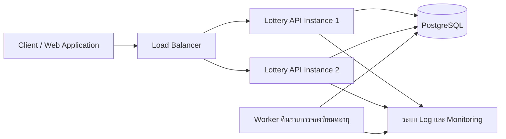
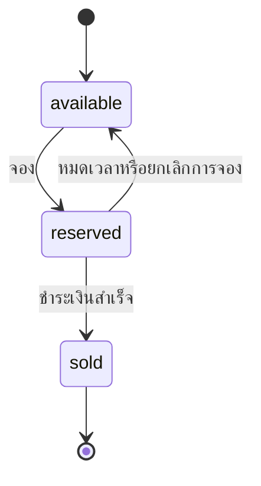

# Lottery Search System Design

[English version](./lottery-search-system.en.md)

## 1. Overview

เอกสารนี้อธิบาย design ของระบบค้นหาและ allocate ticket จากข้อมูลมากกว่า 10 ล้านรายการ โดยสามารถนำแนวทางนี้ไปใช้ต่อใน Production ได้

ticket แต่ละใบมีหมายเลข 6 หลัก ผู้ใช้ค้นหาได้ด้วย pattern ความยาว 6 ตัวอักษร ซึ่งประกอบด้วยตัวเลขและ wildcard (`*`)

ตัวอย่าง search pattern:

| รูปแบบ    | ความหมาย                            |
| -------- | ----------------------------------- |
| `****23` | หมายเลขใดก็ได้ที่ลงท้ายด้วย `23`          |
| `1****5` | หมายเลขที่ขึ้นต้นด้วย `1` และลงท้ายด้วย `5` |
| `123***` | หมายเลขที่ขึ้นต้นด้วย `123`               |

ระบบต้องค้นหาด้วย wildcard ได้เร็วโดยไม่ต้อง scan ข้อมูลทั้งหมด และต้องป้องกันไม่ให้ ticket ใบเดียวกันถูก allocate ให้ผู้ใช้หลายคนพร้อมกัน

## 2. Assumptions

1. ticket แต่ละใบมี `ticket_id` ที่ไม่ซ้ำกัน
2. lottery number เก็บเป็นข้อความความยาว 6 ตัวอักษร เพื่อรักษาเลขศูนย์ด้านหน้า เช่น `001234`
3. ticket คนละใบสามารถมี lottery number เหมือนกันได้ เพราะเลข 6 หลักมีได้ 1 ล้านชุด แต่โจทย์กำหนดให้รองรับ ticket มากกว่า 10 ล้านรายการ
4. search pattern ต้องมีความยาว 6 ตัวอักษรพอดี
5. ตัวอักษรแต่ละตำแหน่งต้องเป็นตัวเลข `0` ถึง `9` หรือ wildcard (`*`)
6. ระบบคืนได้เฉพาะ ticket ที่มีสถานะ `available`
7. การค้นหาและการจองต้องทำเป็น operation เดียวกัน เพื่อป้องกัน duplicate allocation
8. การจองเป็นการจองชั่วคราวและมีเวลาหมดอายุ
9. เมื่อการจองหมดอายุ ticket จะกลับมาเป็น `available`
10. จำนวน ticket ที่คืนต่อหนึ่ง request ต้องจำกัดและตั้งค่าได้

## 3. Proposed Architecture



Architecture เริ่มต้นใช้ PostgreSQL เป็น source of truth สำหรับสถานะของ ticket การจอง และการซื้อ

Lottery API เป็น stateless service และสามารถรันหลาย instance หลัง Load Balancer ได้ โดย PostgreSQL transaction และ row-level locking จะป้องกันไม่ให้ API หลาย instance allocate ticket ใบเดียวกันพร้อมกัน

### 3.1 Client

client ส่ง search pattern ความยาว 6 ตัวอักษรและจำนวน ticket ที่ต้องการ

ตัวอย่าง request:

```json
{
  "pattern": "****23",
  "limit": 5
}
```

ระบบต้องนำ user ID มาจาก session หรือ access token ที่ verify แล้ว

### 3.2 Load Balancer

Load Balancer กระจาย request ไปยัง Lottery API หลาย instance

เพราะ API เป็น stateless ไม่ว่า request จะเข้า instance ไหนก็ทำงานได้เหมือนกัน และสามารถเพิ่มจำนวน instance เมื่อ traffic สูงขึ้น

### 3.3 Lottery API

Lottery API มีหน้าที่:

1. validate ว่า search pattern มีความยาว 6 ตัวอักษรพอดี
2. validate ว่าแต่ละตำแหน่งเป็นตัวเลขหรือ wildcard (`*`)
3. validate และจำกัดจำนวน ticket ที่ user request
4. เริ่ม PostgreSQL transaction
5. ค้นหา ticket ที่ว่างและตรงกับ search pattern
6. lock row ของ ticket ที่เลือก
7. เปลี่ยนสถานะ ticket จาก `available` เป็น `reserved`
8. บันทึกผู้จองและเวลาหมดอายุ
9. commit transaction
10. คืนเฉพาะ ticket ที่จองสำเร็จให้ผู้ใช้

การค้นหาและการจอง ticket ต้องทำให้เสร็จภายใน database transaction เดียวกัน

Flow แบบย่อคือ:

```text
client ส่ง request
→ validate pattern และ limit
→ เริ่ม PostgreSQL transaction
→ ค้นหาและ lock ticket ที่ว่าง
→ เปลี่ยนสถานะเป็น reserved
→ commit transaction
→ คืน ticket ที่จองสำเร็จ
```

### 3.4 PostgreSQL

PostgreSQL ใช้เก็บ:

- Ticket ID
- lottery number 6 หลัก
- สถานะปัจจุบันของ ticket
- ผู้ที่จอง ticket
- เวลาหมดอายุของการจอง
- เวลาที่สร้างและแก้ไขข้อมูล

PostgreSQL เป็นผู้ตัดสินขั้นสุดท้ายว่า ticket ยังว่างอยู่หรือไม่

ticket allocation ทั้งหมดต้องทำกับ primary database เพราะระบบต้องใช้ข้อมูลล่าสุดและต้องรักษาความถูกต้องของข้อมูล

### 3.5 Reservation Cleanup Worker

Cleanup Worker จะทำงานทันทีหนึ่งรอบตอน start จากนั้นเริ่ม cleanup cycle ทุก 1 นาที เพื่อหา reservation ที่หมดอายุและเปลี่ยน ticket จาก `reserved` กลับเป็น `available`

ก่อนคืน ticket ระบบต้อง check ว่า:

- ticket ยังมีสถานะ `reserved`
- เวลาจองหมดอายุแล้ว
- reservation ยังไม่ได้ต่ออายุ
- ticket ยังไม่ได้ถูกซื้อ

Worker process reservation ที่หมดอายุครั้งละ 1,000 records และทำหลาย batch ต่อเนื่องใน cleanup cycle เดียวจนหมด ตัวอย่างเช่น ถ้ามี 50,000 records ระบบจะทำต่อเนื่อง 50 batches ในรอบเดียว ไม่ต้องรอ 50 รอบหรือ 50 นาที

แต่ละ batch ใช้ transaction สั้นแยกจากกัน เพื่อหลีกเลี่ยง transaction ที่ทำงานนานและการ lock row จำนวนมากพร้อมกัน ส่วนการยกเลิกโดยผู้ใช้จะคืน ticket ทันทีโดยไม่ต้องรอ Cleanup Worker

### 3.6 Logging & Monitoring

API และ Cleanup Worker ควรบันทึก log และ metrics ที่สำคัญ เช่น:

- ระยะเวลาในการ process request
- ระยะเวลาของ database query
- ประเภทของ search pattern
- จำนวน ticket ที่ user request
- จำนวน ticket ที่จองสำเร็จ
- allocation ที่ไม่สำเร็จ
- การแย่ง database lock
- จำนวน reservation ที่หมดอายุและถูกคืน
- จำนวน ticket ที่ยังว่าง
- อัตราการเกิด error ของ API และ database

Metrics เหล่านี้ช่วยให้เห็น bottleneck ของระบบ และใช้ดูว่าจำเป็นต้องเพิ่ม optimization หรือไม่

## 4. Database Selection

### 4.1 Recommended Database: PostgreSQL

ระบบนี้เลือก PostgreSQL เป็น database หลักของ Production และเป็น source of truth สำหรับสถานะของ ticket

เหตุผลหลักมีดังนี้:

1. **รองรับ Transaction ที่น่าเชื่อถือ**  
   การค้นหา lock และจอง ticket สามารถทำให้เสร็จภายใน transaction เดียวกันได้

2. **รองรับ Row-level Locking**  
   PostgreSQL สามารถ lock เฉพาะ row ของ ticket ที่ถูกเลือก โดยไม่ต้อง lock ทั้ง table

3. **รองรับ `FOR UPDATE SKIP LOCKED`**  
   หาก ticket ถูก transaction อื่น lock อยู่ request ที่เข้ามาพร้อมกันสามารถข้ามไปหา ticket ใบอื่นได้

4. **รองรับการเปลี่ยนสถานะแบบ Atomic**  
   ticket สามารถเปลี่ยนจาก `available` เป็น `reserved` ได้เฉพาะเมื่อ ticket ยังว่างอยู่จริง

5. **รองรับ Index หลายรูปแบบ**  
   PostgreSQL รองรับ B-tree index, composite index และ partial index

6. **ดูแลระบบได้ง่ายกว่า**  
   ข้อมูล ticket และสถานะการจองอยู่ใน database เดียว จึงลดปัญหาการ sync ข้อมูลระหว่างหลายระบบ

7. **เหมาะกับขนาดข้อมูลตามโจทย์**  
   PostgreSQL สามารถรองรับ ticket มากกว่า 10 ล้าน records ได้ หากออกแบบ schema, index และ query อย่างเหมาะสม

### 4.2 Concurrent Ticket Allocation

Lottery API หลาย instance อาจพยายาม allocate ticket ที่ตรงกับ pattern ในเวลาเดียวกัน

PostgreSQL จัดการเรื่องนี้ด้วยการ lock row ที่เลือกภายใน transaction โดยใช้ `FOR UPDATE SKIP LOCKED` เพื่อข้าม ticket ที่ request อื่นกำลังใช้งานอยู่

Flow จะเป็นแบบนี้:

```text
User A
→ lock ticket T001
→ เปลี่ยน T001 เป็น reserved
→ ได้รับ T001

User B เข้ามาพร้อมกัน
→ ข้าม ticket T001 ที่ถูก lock
→ lock ticket ที่ยังว่างใบอื่น
→ ได้รับ ticket คนละใบ
```

วิธีนี้ป้องกันไม่ให้ `ticket_id` เดียวกันถูก allocate ให้ user หลายคนพร้อมกัน

ticket คนละใบยังสามารถมี lottery number เหมือนกันได้ ตัวอย่าง:

```text
T001 → 123423
T002 → 123423
```

ticket ทั้งสองใบสามารถถูก allocate ได้ เพราะมี `ticket_id` ต่างกัน

### 4.3 Primary Database Usage

request สำหรับค้นหาและ allocate ticket ต้องส่งไปยัง primary PostgreSQL database

ไม่ควรใช้ read replica ตัดสินใจเรื่อง allocation เพราะ replication delay อาจทำให้ replica แสดงว่า ticket ยังว่าง ทั้งที่ ticket ถูกจองใน primary database แล้ว

ในอนาคตสามารถใช้ read replica สำหรับงาน report หรือ analytics ที่ยอมรับข้อมูลล่าช้าเล็กน้อยได้

### 4.4 Future Consideration: Redis

มีการพิจารณา Redis ไว้เป็นทางเลือกสำหรับเพิ่มประสิทธิภาพในอนาคต เช่น:

- API rate limiting
- cache ข้อมูลที่ไม่ส่งผลต่อความถูกต้องของระบบ
- cache ข้อมูลประกอบการค้นหา
- ลดการอ่านข้อมูลซ้ำในจุดที่ผลทดสอบพบว่าเป็น bottleneck

ระบบเวอร์ชันแรกยังไม่เพิ่ม Redis ใน ticket allocation flow

PostgreSQL รองรับ transaction และ row-level locking ที่ใช้ป้องกัน duplicate allocation อยู่แล้ว การเพิ่ม Redis ก่อนพบ performance bottleneck จากผลการวัดจริงจะทำให้ infrastructure และการ sync ข้อมูลซับซ้อนขึ้นโดยไม่จำเป็น

ถ้าเพิ่ม Redis ในอนาคต PostgreSQL จะยังเป็น source of truth และ final ticket allocation ต้อง validate และ commit แบบ atomic ใน PostgreSQL เสมอ

## 5. Data Model

### 5.1 Ticket Table

ตาราง `tickets` ใช้เก็บ ticket แต่ละใบและ allocation status ปัจจุบัน

Schema จะเป็นแบบนี้:

```sql
CREATE TYPE ticket_status AS ENUM (
    'available',
    'reserved',
    'sold'
);

CREATE TABLE tickets (
    ticket_id BIGSERIAL PRIMARY KEY,
    number CHAR(6) NOT NULL,

    digit_1 SMALLINT NOT NULL,
    digit_2 SMALLINT NOT NULL,
    digit_3 SMALLINT NOT NULL,
    digit_4 SMALLINT NOT NULL,
    digit_5 SMALLINT NOT NULL,
    digit_6 SMALLINT NOT NULL,

    status ticket_status NOT NULL DEFAULT 'available',

    reserved_by UUID,
    reserved_until TIMESTAMPTZ,

    sold_to UUID,
    sold_at TIMESTAMPTZ,

    created_at TIMESTAMPTZ NOT NULL DEFAULT NOW(),
    updated_at TIMESTAMPTZ NOT NULL DEFAULT NOW(),

    CHECK (number ~ '^[0-9]{6}$'),
    CHECK (digit_1 BETWEEN 0 AND 9),
    CHECK (digit_2 BETWEEN 0 AND 9),
    CHECK (digit_3 BETWEEN 0 AND 9),
    CHECK (digit_4 BETWEEN 0 AND 9),
    CHECK (digit_5 BETWEEN 0 AND 9),
    CHECK (digit_6 BETWEEN 0 AND 9)
);
```

lottery number เก็บเป็น `CHAR(6)` แทน integer เพื่อรักษาเลขศูนย์ด้านหน้า

ตัวอย่าง:

```text
001234
```

ต้องยังคงเป็น `001234` และต้องไม่กลายเป็น `1234`

นอกจากนี้ยังแยกตัวเลขแต่ละตำแหน่งไว้ในคนละ column เพื่อให้การค้นหาด้วย wildcard สามารถใช้ index ได้ง่ายขึ้น

ตัวอย่าง pattern:

```text
1**4*6
```

สามารถแปลงเป็นเงื่อนไข:

```sql
WHERE digit_1 = 1
  AND digit_4 = 4
  AND digit_6 = 6
```

### 5.2 Ticket Status

ticket เปลี่ยนสถานะตาม flow ดังนี้:



แต่ละสถานะมีความหมายดังนี้:

| สถานะ       | ความหมาย                                   |
| ----------- | ------------------------------------------ |
| `available` | ticket สามารถถูกค้นหาและ allocate ได้              |
| `reserved`  | ticket ถูกจองชั่วคราวโดยผู้ใช้                   |
| `sold`      | การซื้อเสร็จสมบูรณ์และ ticket ไม่สามารถ allocate ได้อีก |

เมื่อ ticket อยู่ในสถานะ `reserved` ต้องมีค่า `reserved_by` และ `reserved_until`

เมื่อซื้อสำเร็จ ticket จะเปลี่ยนเป็น `sold` และบันทึก `sold_to` กับ `sold_at`

### 5.3 Data Consistency Rules

Application ต้องรักษา rules ต่อไปนี้:

1. `number` ต้องประกอบด้วยตัวเลข 6 หลักเสมอ
2. `digit_1` ถึง `digit_6` ต้องตรงกับแต่ละตำแหน่งของ `number`
3. ticket ที่เป็น `available` ต้องไม่มี reservation ที่ยังใช้งานอยู่
4. ticket ที่เป็น `reserved` ต้องมี `reserved_by` และ `reserved_until`
5. ticket ที่เป็น `sold` ไม่สามารถกลับไปเป็น `available`
6. ticket คนละใบสามารถมี lottery number เหมือนกันได้ เพราะใช้ `ticket_id` แยก ticket แต่ละใบ

ในการพัฒนาจริง digit columns อาจสร้างจาก `number` โดยอัตโนมัติ หรือกำหนดผ่านกระบวนการ import ticket ที่ควบคุมไว้ เพื่อป้องกันค่าที่ไม่ตรงกัน

## 6. Indexing Strategy

B-tree index บน `number` ทั้งชุดเหมาะกับการค้นหาเลขตรงตัวและการค้นหาแบบ prefix แต่ไม่เพียงพอสำหรับ wildcard ที่อยู่ตำแหน่งใดก็ได้

ตัวอย่าง:

```text
123*** → ใช้ prefix index ได้ดี
***456 → ใช้ B-tree ที่เริ่มจากด้านหน้าได้ไม่ดี
1**4*6 → กำหนดตัวเลขไว้หลายตำแหน่ง
```

Design นี้จะแยกตัวเลขแต่ละตำแหน่งเป็น column และสร้าง partial index เฉพาะ ticket ที่ยัง `available`

### 6.1 Available Ticket Index

```sql
CREATE INDEX idx_tickets_available
ON tickets (ticket_id)
WHERE status = 'available';
```

Index นี้รองรับ pattern ที่เป็น wildcard ทั้งหมด:

```text
******
```

และช่วยให้ระบบเลือก ticket ที่ว่างจำนวนเล็กน้อยได้โดยไม่ต้อง scan ticket ที่ถูกจองหรือขายแล้ว

### 6.2 Exact Number and Prefix Index

```sql
CREATE INDEX idx_tickets_available_number
ON tickets (number, ticket_id)
WHERE status = 'available';
```

Index นี้รองรับ:

- การค้นหาเลขตรงตัว เช่น `123456`
- การค้นหาแบบ prefix เช่น `123***`
- การเลือกเฉพาะ ticket ที่ยังว่าง

B-tree index บน `number` เรียงข้อมูลจากซ้ายไปขวา จึงค้นหาค่าตรงตัวหรือช่วงข้อมูลที่มี prefix เดียวกันได้ดี เช่น ช่วง `123000` ถึง `123999`

แต่ไม่เหมาะกับ suffix pattern เช่น `****23` ซึ่งปกติจะแปลงเป็น `number LIKE '%23'` เนื่องจากระบบไม่รู้ตัวเลขด้านซ้าย ค่าที่ลงท้ายด้วย `23` จึงกระจายอยู่หลายตำแหน่งใน index และ PostgreSQL ไม่สามารถเข้าไปยังช่วงข้อมูลเดียวได้โดยตรง

ดังนั้น suffix และ wildcard ที่อยู่ตำแหน่งใดก็ได้จะใช้ positional digit indexes ในหัวข้อถัดไป

### 6.3 Positional Digit Indexes

```sql
CREATE INDEX idx_tickets_available_digit_1
ON tickets (digit_1, ticket_id)
WHERE status = 'available';

CREATE INDEX idx_tickets_available_digit_2
ON tickets (digit_2, ticket_id)
WHERE status = 'available';

CREATE INDEX idx_tickets_available_digit_3
ON tickets (digit_3, ticket_id)
WHERE status = 'available';

CREATE INDEX idx_tickets_available_digit_4
ON tickets (digit_4, ticket_id)
WHERE status = 'available';

CREATE INDEX idx_tickets_available_digit_5
ON tickets (digit_5, ticket_id)
WHERE status = 'available';

CREATE INDEX idx_tickets_available_digit_6
ON tickets (digit_6, ticket_id)
WHERE status = 'available';
```

PostgreSQL Query Planner อาจเลือกใช้ positional index หนึ่งตัวหรือ combine หลาย index ขึ้นอยู่กับข้อมูลและ selectivity ของ pattern แต่ไม่ได้รับประกันว่าจะเลือก plan เดิมทุกครั้ง จึงต้อง check ด้วย `EXPLAIN ANALYZE` และข้อมูลขนาดใกล้เคียง Production

Positional digit indexes เหมาะกับ suffix และ wildcard ที่อยู่ตำแหน่งใดก็ได้มากกว่า เพราะ API สามารถแปลงตัวเลขแต่ละตำแหน่งที่กำหนดไว้เป็น equality condition บน column ที่แน่นอน

ตัวอย่าง:

```text
****23
```

แปลงเป็น:

```sql
WHERE status = 'available'
  AND digit_5 = 2
  AND digit_6 = 3
```

วิธีนี้หลีกเลี่ยง leading wildcard เช่น `number LIKE '%23'` และทำให้ PostgreSQL ใช้ index ของตำแหน่งที่ 5 และ 6 ได้

ตัวอย่าง pattern:

```text
1****5
```

แปลงเป็น:

```sql
WHERE status = 'available'
  AND digit_1 = 1
  AND digit_6 = 5
```

PostgreSQL สามารถใช้ index ของ `digit_1` และ `digit_6` ร่วมกัน แทนการ scan ticket ทั้งหมด

### 6.4 Expired Reservation Index

```sql
CREATE INDEX idx_tickets_expired_reservations
ON tickets (reserved_until, ticket_id)
WHERE status = 'reserved';
```

Index นี้ช่วยให้ Cleanup Worker ค้นหา reservation ที่หมดอายุได้เร็ว:

```sql
WHERE status = 'reserved'
  AND reserved_until < NOW()
```

### 6.5 Index Trade-offs

Index ช่วยให้ค้นหาเร็วขึ้น แต่ทำให้:

- ใช้พื้นที่จัดเก็บเพิ่มขึ้น
- import ticket ช้าลง
- การ update สถานะ ticket มี cost เพิ่มขึ้น
- ต้อง monitor ว่าแต่ละ index ถูกใช้งานจริงหรือไม่

PostgreSQL จะอัปเดต index ที่เกี่ยวข้องให้อัตโนมัติเมื่อ insert ticket หรือเปลี่ยน status ฝั่ง Application ไม่ต้องแก้ index เอง แต่ทีมควร monitor ขนาดของ index, write performance และ query plan หากพบ index ที่ไม่ถูกใช้หรือซ้ำกับตัวอื่น ควรนำออก เพราะยังใช้ storage และเพิ่มงานให้ทุก insert หรือ update ที่เกี่ยวข้อง

ระบบไม่ควรสร้าง index สำหรับ wildcard ทุก combination เพราะตัวเลข 6 ตำแหน่งสามารถสร้าง combination ได้หลายรูปแบบ และจะทำให้ใช้พื้นที่กับ cost ในการเขียนข้อมูลมากเกินความจำเป็น

Positional indexes ชุดนี้เป็น starting point ส่วน index ที่ใช้จริงใน Production ควรปรับตาม search traffic, index usage metrics และ check ด้วย PostgreSQL `EXPLAIN ANALYZE`

## 7. Wildcard Search Algorithm

### 7.1 Pattern Validation

API ต้อง validate pattern ก่อน query database

Pattern ที่ถูกต้องต้อง:

1. มีความยาว 6 ตัวอักษรพอดี
2. ประกอบด้วยตัวเลข `0` ถึง `9` หรือ wildcard (`*`) เท่านั้น
3. ไม่มีช่องว่างหรืออักขระพิเศษอื่น

ตัวอย่าง:

| Pattern   | ถูกต้อง | เหตุผล                |
| --------- | ----: | -------------------- |
| `****23`  |    ใช่ | มีอักขระที่ถูกต้องครบ 6 ตัว |
| `123456`  |    ใช่ | เป็นตัวเลข 6 หลัก       |
| `******`  |    ใช่ | ทุกตำแหน่งเป็น wildcard  |
| `12345`   |  ไม่ใช่ | มีเพียง 5 ตัว           |
| `1234567` |  ไม่ใช่ | มีมากกว่า 6 ตัว         |
| `12A***`  |  ไม่ใช่ | มีอักขระที่ระบบไม่รองรับ   |

Pattern validation ใช้เวลาคงที่ เพราะระบบเช็กเพียง 6 ตำแหน่งเสมอ

### 7.2 Pattern Conversion

API ไล่ดูตัวอักษรแต่ละตำแหน่งใน pattern

- ถ้าเป็นตัวเลข ให้สร้างเงื่อนไขสำหรับ digit column ตำแหน่งนั้น
- ถ้าเป็น wildcard ไม่ต้องสร้างเงื่อนไขสำหรับตำแหน่งนั้น

ตัวอย่าง:

```text
Pattern: 1**4*6
```

การแปลง:

```text
ตำแหน่ง 1 → digit_1 = 1
ตำแหน่ง 2 → wildcard ไม่มีเงื่อนไข
ตำแหน่ง 3 → wildcard ไม่มีเงื่อนไข
ตำแหน่ง 4 → digit_4 = 4
ตำแหน่ง 5 → wildcard ไม่มีเงื่อนไข
ตำแหน่ง 6 → digit_6 = 6
```

เงื่อนไขที่ได้:

```sql
WHERE status = 'available'
  AND digit_1 = $1
  AND digit_4 = $2
  AND digit_6 = $3
```

ค่าตัวเลขต้องส่งผ่าน query parameters ห้ามนำ input ของผู้ใช้ไปต่อเป็น SQL โดยตรง

### 7.3 Pattern Conversion Examples

| Input Pattern | เงื่อนไขใน Database                               |
| ------------- | ----------------------------------------------- |
| `123456`      | `number = '123456'`                             |
| `123***`      | `number LIKE '123%'` หรือใช้ digit columns        |
| `****23`      | `digit_5 = 2 AND digit_6 = 3`                   |
| `1****5`      | `digit_1 = 1 AND digit_6 = 5`                   |
| `******`      | ไม่มีเงื่อนไขตัวเลข กรองเฉพาะ `status = 'available'` |

หากเป็นเลขตรงตัวหรือ prefix สามารถใช้ indexed `number` column ได้

หาก wildcard อยู่ตำแหน่งใดก็ได้ API จะใช้ positional digit columns

### 7.4 Result Limit

ทุก request ต้องจำกัดจำนวน ticket ที่ต้องการ

ตัวอย่าง:

```json
{
  "pattern": "****23",
  "limit": 5
}
```

API ควรกำหนด:

- default limit เมื่อ client ไม่ได้ส่งมา
- maximum limit ที่อนุญาต
- validate ว่า limit มากกว่า 0 และไม่เกิน maximum limit

นโยบายเริ่มต้นที่เหมาะสมคือ:

```text
Default limit: 10
Maximum limit: 100
```

หากจำนวน ticket ที่ว่างน้อยกว่าที่ผู้ใช้ขอ ระบบจะคืนเฉพาะ ticket ที่จองสำเร็จ โดยไม่ทำให้ request ทั้งหมดล้มเหลว

## 8. Atomic Ticket Allocation

### 8.1 Search and Reserve Transaction

การค้นหาและจอง ticket ต้องทำภายใน PostgreSQL transaction เดียวกัน

SQL ต่อไปนี้เป็นตัวอย่าง ticket allocation สำหรับ pattern `****23`:

```sql
BEGIN;

WITH selected_tickets AS (
    SELECT ticket_id
    FROM tickets
    WHERE status = 'available'
      AND digit_5 = 2
      AND digit_6 = 3
    ORDER BY ticket_id
    FOR UPDATE SKIP LOCKED
    LIMIT 5
)
UPDATE tickets AS t
SET
    status = 'reserved',
    reserved_by = $1,
    reserved_until = NOW() + INTERVAL '5 minutes',
    updated_at = NOW()
FROM selected_tickets AS selected
WHERE t.ticket_id = selected.ticket_id
  AND t.status = 'available'
RETURNING
    t.ticket_id,
    t.number,
    t.status,
    t.reserved_by,
    t.reserved_until;

COMMIT;
```

Flow นี้ทำงานดังนี้:

1. ค้นหา ticket ที่ว่างและตรงกับ pattern
2. lock row ของ ticket ที่เลือก
3. ข้าม row ที่ถูก transaction อื่น lock อยู่
4. เปลี่ยน ticket ที่เลือกเป็น `reserved`
5. บันทึกผู้ที่จอง
6. กำหนดเวลาหมดอายุของการจอง
7. คืนเฉพาะ ticket ที่จองสำเร็จ
8. commit transaction

เงื่อนไขเพิ่มเติม:

```sql
AND t.status = 'available'
```

เป็นการ double-check ว่า update เฉพาะ ticket ที่ยังว่างอยู่จริง

### 8.2 Concurrent Request Example

สมมติว่ามี ticket ที่ว่าง:

```text
T001 → 123423
T002 → 555523
T003 → 999923
```

User A และ User B ค้นหา `****23` พร้อมกัน

ผลลัพธ์ที่เป็นไปได้:

```text
Transaction ของ User A
→ lock T001
→ จอง T001

Transaction ของ User B
→ ข้าม T001 ที่ถูก lock
→ lock T002
→ จอง T002
```

ทั้งสอง request สามารถทำงานพร้อมกันได้โดยไม่ได้รับ `ticket_id` เดียวกัน

### 8.3 Purchase Confirmation

เมื่อชำระเงินสำเร็จ API จะเปลี่ยน ticket จาก `reserved` เป็น `sold` แบบ atomic

```sql
UPDATE tickets
SET
    status = 'sold',
    sold_to = $1,
    sold_at = NOW(),
    reserved_by = NULL,
    reserved_until = NULL,
    updated_at = NOW()
WHERE ticket_id = $2
  AND status = 'reserved'
  AND reserved_by = $1
  AND reserved_until > NOW()
RETURNING ticket_id, number, status, sold_to, sold_at;
```

การซื้อจะสำเร็จเมื่อ:

- ticket ยังมีสถานะ `reserved`
- reservation เป็นของ user ที่ยืนยันตัวตนแล้ว
- reservation ยังไม่หมดอายุ

หากไม่มี row ถูกคืนกลับมา ระบบต้องปฏิเสธการซื้อ เพราะ reservation อาจไม่มีอยู่ หมดอายุแล้ว หรือเป็นของผู้ใช้คนอื่น

### 8.4 Reservation Cancellation

ผู้ใช้สามารถคืน ticket ก่อนหมดเวลาจองได้:

```sql
UPDATE tickets
SET
    status = 'available',
    reserved_by = NULL,
    reserved_until = NULL,
    updated_at = NOW()
WHERE ticket_id = $1
  AND status = 'reserved'
  AND reserved_by = $2
RETURNING ticket_id;
```

ผู้ใช้ที่ยืนยันตัวตนแล้วสามารถยกเลิกได้เฉพาะ reservation ของตัวเอง

### 8.5 Expired Reservation Cleanup

Cleanup Worker ทำงานหนึ่งรอบทันทีเมื่อเริ่มต้น จากนั้นทำงานทุก 1 นาที ในแต่ละ cleanup cycle Worker จะเรียก batch operation ต่อไปนี้ซ้ำจนไม่พบ reservation ที่หมดอายุเหลืออยู่:

```sql
WITH expired_tickets AS (
    SELECT ticket_id
    FROM tickets
    WHERE status = 'reserved'
      AND reserved_until < NOW()
    ORDER BY reserved_until
    FOR UPDATE SKIP LOCKED
    LIMIT 1000
)
UPDATE tickets AS t
SET
    status = 'available',
    reserved_by = NULL,
    reserved_until = NULL,
    updated_at = NOW()
FROM expired_tickets AS expired
WHERE t.ticket_id = expired.ticket_id
  AND t.status = 'reserved'
  AND t.reserved_until < NOW();
```

แต่ละ batch จะ commit ด้วย transaction สั้นแยกจากกัน เมื่อ batch ก่อนหน้า update ครบ 1,000 records Worker จะเริ่ม batch ถัดไปทันที และจะจบรอบเมื่อ batch คืนจำนวนที่ update เท่ากับศูนย์

ตัวอย่างเช่น หากมี reservation หมดอายุ 50,000 records และกำหนด batch ละ 1,000 records ระบบจะทำต่อเนื่อง 50 batches ภายใน cleanup cycle เดียว ไม่ต้องรอ 50 นาที

การกำหนด batch limit ช่วยป้องกันไม่ให้ Worker lock และ update row จำนวนมากเกินไปใน transaction เดียว

`SKIP LOCKED` ยังช่วยให้รัน Worker หลาย instance ได้โดยไม่ process row เดียวกัน

### 8.6 Transaction Failure

หาก operation ใดล้มเหลวก่อน commit PostgreSQL จะ rollback transaction

ตัวอย่าง:

```text
เลือกและ lock row แล้ว
→ update ล้มเหลว
→ transaction rollback
→ ปลด lock
→ ticket ยังคง available
```

API ต้องคืน error และห้ามรายงานว่า ticket ถูกจองสำเร็จ จนกว่า transaction จะ commit สำเร็จแล้ว

## 9. Performance and Scalability Analysis

### 9.1 Search Complexity

Pattern validation และ conversion จะอ่านตัวอักษรเพียง 6 ตำแหน่งเสมอ จึงมี cost ในระดับ Application เท่ากับ `O(6)` ซึ่งถือเป็น `O(1)`

Performance ของ database ขึ้นอยู่กับ selectivity ของ pattern:

| ประเภท Pattern | ตัวอย่าง | แนวทางที่คาดว่าจะใช้ |
| -------------- | ------- | -------------------- |
| เลขตรงตัว | `123456` | ใช้ available-number index |
| Prefix | `123***` | ใช้ available-number index |
| กำหนดหลายตำแหน่ง | `1**4*6` | ใช้ positional digit indexes ร่วมกัน |
| กำหนดตัวเลขน้อยตำแหน่ง | `*****6` | ใช้ positional index และหยุดเมื่อครบ limit |
| Wildcard ทุกตำแหน่ง | `******` | ใช้ available-ticket index และหยุดเมื่อครบ limit |

Query ไม่จำเป็นต้องคืนข้อมูลที่ตรงทั้งหมด แต่จะหยุดเมื่อเลือก ticket ครบตามจำนวนที่ร้องขอ โดยกำหนด maximum limit เริ่มต้นไว้ที่ 100

Pattern ที่กำหนดตัวเลขน้อยตำแหน่งจะมี selectivity ต่ำ ทำให้ database อาจต้องตรวจ candidate rows มากขึ้น จึงควรเช็ก query plan ด้วยข้อมูลขนาดใกล้เคียง Production ผ่าน `EXPLAIN (ANALYZE, BUFFERS)`

### 9.2 Allocation Cost

หาก request ต้องการ ticket จำนวน `k` ใบ database จะ lock และ update ไม่เกิน `k` rows โดย API จะเป็นตัวจำกัดค่า `k`

Allocation cost ประกอบด้วย:

1. ค้นหา candidate ticket ที่ว่างและตรงกับ pattern ผ่าน index
2. lock row ไม่เกิน `k` rows
3. เปลี่ยนสถานะ row เหล่านั้นเป็น `reserved`
4. ปรับปรุง index ที่ได้รับผลกระทบจากการเปลี่ยนสถานะ

Transaction ที่สั้นและ result limit ที่มีขนาดเล็กช่วยลดระยะเวลาการถือ lock และลดการแย่ง lock ระหว่าง request ที่เข้ามาพร้อมกัน

### 9.3 Cleanup Worker Cost

หากมี reservation หมดอายุจำนวน `e` records งาน cleanup จะมี cost `O(e)` และ process ทีละ 1,000 records

แต่ละ batch จะ commit แยกกัน ช่วยจำกัดระยะเวลาของ transaction, การใช้ memory, จำนวน lock และ cost ของการ rollback ระบบควร monitor จำนวนงานที่ค้างและเวลาที่ใช้ เพื่อปรับ batch size หรือจำนวน Worker เมื่อจำเป็น

### 9.4 Lottery API Scaling

Lottery API เป็น stateless จึง scale จำนวน instance หลัง Load Balancer ได้

ทุก instance ใช้ PostgreSQL ร่วมกันเพื่อรักษาความถูกต้องของ allocation การเพิ่ม API instance จึงไม่ทำให้ reservation state แยกกัน และ `FOR UPDATE SKIP LOCKED` ช่วยให้แต่ละ instance process ticket คนละ row ได้พร้อมกัน

แต่ละ instance ต้องใช้ database connection pool ที่จำกัดขนาด และจำนวน connection สูงสุดรวมจาก API กับ Worker ทุก instance ต้องไม่เกิน connection limit ของ PostgreSQL

### 9.5 Database Scaling

ระบบเริ่มต้นใช้ PostgreSQL primary หนึ่งชุด พร้อม automated backup

ถ้าต้อง scale database เพิ่ม สามารถทำได้ดังนี้:

- เพิ่ม CPU, memory และ performance ของ database storage
- ปรับ index ตาม query plan ที่วัดได้จริง
- archive ข้อมูล ticket ที่ขายแล้วและเก่ามาก
- ใช้ read replica เฉพาะงาน report และ analytics

request สำหรับ allocate ticket ต้องใช้ primary database ต่อไป เพราะข้อมูลจาก replica อาจช้ากว่า primary และแสดงสถานะ ticket ที่ยังไม่อัปเดต

### 9.6 Performance Trade-offs

Design นี้มี trade-offs ดังนี้:

- Positional indexes ใช้พื้นที่เพิ่มขึ้น แต่ช่วยให้ wildcard ที่อยู่ตำแหน่งใดก็ได้ค้นหาได้เร็วขึ้น
- Partial index สำหรับ ticket ที่ว่างมีขนาดเล็กกว่า แต่การเปลี่ยนสถานะทำให้ต้องปรับปรุง index
- Row locking รักษาความถูกต้อง แต่ pattern ที่ได้รับความนิยมสูงอาจทำให้เกิด lock contention
- Transaction ขนาดเล็กช่วยลดระยะเวลาการ lock แต่ cleanup ขนาดใหญ่ต้องเรียก database หลายรอบ
- PostgreSQL ที่เป็น source of truth เพียงแห่งเดียวช่วยลดความซับซ้อนและรักษาความถูกต้อง แต่ต้อง monitor database เพราะเป็น dependency หลักของระบบ

ควรปรับ trade-offs เหล่านี้จาก traffic ที่วัดได้จริง ไม่ใช่จากการคาดเดาอย่างเดียว

### 9.7 Load Testing Plan

Load Test คือการจำลองให้ผู้ใช้จำนวนมากเรียก API พร้อมกัน เพื่อทดสอบทั้งความเร็วและความถูกต้องของระบบภายใต้ traffic ที่ใกล้เคียงการใช้งานจริง ซึ่งต่างจาก Unit Test ที่ตรวจการทำงานของ function หนึ่งส่วน

ก่อนขึ้น Production ควรทดสอบด้วยข้อมูล ticket อย่างน้อย 10 ล้าน records ที่ใกล้เคียงข้อมูลจริง เพราะ dataset ขนาดเล็กอาจซ่อนปัญหา slow query ที่จะเกิดเมื่อข้อมูลมีขนาดตามโจทย์

Load Test ควรประกอบด้วย:

- เลขตรงตัว เช่น `123456`
- Prefix pattern เช่น `123***`
- Suffix pattern เช่น `****23`
- Pattern ที่กำหนดหลายตำแหน่ง เช่น `1**4*6`
- Pattern ที่กว้าง เช่น `******`
- ผู้ใช้จำนวนมากค้นหา pattern ยอดนิยมเดียวกันพร้อมกัน
- Cleanup Worker ทำงานพร้อมกับ ticket allocation
- กรณีจองสำเร็จ, ticket ไม่เพียงพอ และ reservation หมดอายุ

ค่าที่ควรวัดประกอบด้วย:

- **p50, p95 และ p99 latency:** ใช้ดูว่า request ส่วนใหญ่ตอบกลับเร็วแค่ไหน รวมถึงกลุ่มผู้ใช้ที่ได้รับ response ช้าที่สุด
- **จำนวน request ต่อวินาที:** ใช้ดูว่าระบบรองรับ traffic ได้มากเท่าไร
- **CPU และ I/O ของ database:** ใช้ดูว่า PostgreSQL ใกล้ใช้ resource เต็มหรือไม่
- **จำนวน row ที่ Query ตรวจสอบ:** ใช้ตรวจว่า index ช่วยลดการอ่านข้อมูลที่ไม่จำเป็นได้จริงหรือไม่
- **ระยะเวลารอ lock และจำนวน row ที่ถูกข้าม:** ใช้ดูว่า request จำนวนมากกำลังแย่ง ticket กลุ่มเดียวกันหรือไม่
- **การใช้ database connection pool:** ใช้ดูว่า request ต้องรอ connection บ่อยหรือไม่
- **Cleanup backlog:** ใช้ดูว่า Worker จัดการ reservation ที่หมดอายุได้เร็วกว่าจำนวนที่เพิ่มขึ้นหรือไม่
- **อัตรา error และ timeout:** ใช้ดูว่า request ล้มเหลวหรือใช้เวลานานเกินกำหนดบ่อยแค่ไหน

ตัวอย่างเช่น `p95 = 200 ms` หมายความว่า 95 เปอร์เซ็นต์ของ request ตอบกลับภายใน 200 milliseconds ค่านี้ช่วยให้เห็น request ที่ช้าได้ชัดกว่าค่าเฉลี่ย เพราะค่าเฉลี่ยที่ดูดีอาจซ่อน request บางส่วนที่ช้ามากไว้

ผลการทดสอบจะใช้ดูว่าต้องปรับ index หรือเพิ่ม optimization อย่าง Redis สำหรับงานที่ไม่กระทบความถูกต้องหรือไม่

## 10. Real-world Failure Handling

หัวข้อนี้อธิบายว่าเมื่อ database มีปัญหา, Cleanup Worker หยุดทำงาน หรือ user ส่งข้อมูลผิด ระบบจะรับมืออย่างไร

### 10.1 Database and Transaction Failure

การเลือกและจอง ticket ทำอยู่ใน transaction เดียวกัน

หากขั้นตอนใดล้มเหลวก่อน `COMMIT` PostgreSQL จะ rollback:

```text
ค้นหาและ lock ticket
→ update การจองไม่สำเร็จ
→ rollback
→ ปล่อย lock
→ ticket ยังคงสถานะเดิม
```

API จะคืน error และต้องไม่แจ้ง client ว่าจองสำเร็จจนกว่า transaction จะ commit สำเร็จแล้ว

database query ควรมี timeout เพื่อไม่ให้ query ที่ช้าหรือมีปัญหาค้างอยู่ตลอดไป

### 10.2 Cleanup Worker Failure

หาก Cleanup Worker หยุดทำงาน ข้อมูล reservation จะไม่หาย เพราะข้อมูลทั้งหมดเก็บอยู่ใน PostgreSQL

เมื่อ Worker กลับมาทำงาน จะเริ่ม cleanup ทันทีหนึ่งรอบก่อนกลับเข้าสู่รอบปกติทุก 1 นาที และทำหลาย batch ต่อเนื่องจน backlog หมด

หาก batch ใดทำงานไม่สำเร็จ Worker จะบันทึก error และลองใหม่หลังจากรอช่วงเวลาสั้น ๆ ระบบ Monitoring ควรแจ้งเตือนทีมเมื่อ reservation ที่หมดอายุสะสมเพิ่มขึ้นต่อเนื่อง

### 10.3 Authentication and Authorization

ผู้ใช้ต้องเข้าสู่ระบบก่อนจึงจะจอง ยกเลิก หรือซื้อ ticket ได้

API นำข้อมูล user มาจาก access token หรือ session ที่ verify แล้ว โดย user สามารถยกเลิกหรือซื้อได้เฉพาะ ticket ที่ตัวเองจองไว้เท่านั้น

Admin operations เช่น import ticket หรือแก้ไข inventory ต้องใช้สิทธิ์ admin แยกต่างหาก

### 10.4 Request Validation and Rate Limiting

ก่อนเรียก database API ต้อง:

- validate ว่า pattern มีตัวเลขหรือ wildcard ที่ถูกต้องครบ 6 ตัว
- validate ว่า limit มากกว่า 0 และไม่เกิน maximum limit
- ส่งค่าผ่าน SQL parameters แทนการนำ input ของผู้ใช้ไปต่อเป็น SQL โดยตรง
- กำหนด timeout สำหรับ request และ database query
- จำกัดขนาด request body
- จำกัดความถี่ในการค้นหาของผู้ใช้
- คืนข้อความ error ที่ปลอดภัย โดยไม่เปิดเผยรายละเอียดภายใน database

ระบบเริ่มต้นสามารถทำ rate limiting ที่ API Gateway หรือ Load Balancer และค่อยพิจารณา Redis ถ้าต้องแชร์ rate limit ระหว่าง server หลายเครื่อง

### 10.5 Backup

PostgreSQL ควรทำ automated backup

ทีมต้องลอง restore backup เป็นระยะ เพราะการมี backup file อย่างเดียวไม่พอ ถ้าไม่เคยเช็กว่าสามารถกู้ข้อมูลกลับมาได้จริง

## 11. Design Summary

Design นี้ใช้ Lottery API แบบ stateless หลาย instance หลัง Load Balancer และใช้ PostgreSQL เป็น source of truth

lottery number เก็บเป็นข้อความ 6 ตัวอักษร พร้อม positional digit columns และ indexes สำหรับช่วยค้นหา wildcard โดย API จะแปลงตำแหน่งที่เป็นตัวเลขใน pattern ให้เป็น parameterized database conditions

การค้นหาและจอง ticket ทำแบบ atomic ภายใน PostgreSQL transaction เดียว โดยใช้ row-level locking และ `FOR UPDATE SKIP LOCKED` วิธีนี้ป้องกันไม่ให้ `ticket_id` เดียวกันถูก allocate ให้ user หลายคนพร้อมกัน และยังทำให้ request ที่เข้ามาพร้อมกันสามารถ allocate ticket คนละใบได้

Reservation มีเวลาหมดอายุ Cleanup Worker จะทำงานทันทีตอน start จากนั้นทำงานทุก 1 นาที และ process หลาย batch ต่อเนื่องจน expired-reservation backlog หมด

ระบบรองรับข้อมูลมากกว่า 10 ล้าน records ด้วย result limit, indexes ที่ตรงกับ search pattern, transaction ที่สั้น, horizontal API scaling และ Load Test ด้วยข้อมูลใกล้เคียง Production ส่วน Redis ยังไม่จำเป็นใน allocation flow แรก แต่สามารถพิจารณาในอนาคตสำหรับ cache ที่ไม่กระทบความถูกต้องหรือ distributed rate limiting

โดยรวม design นี้เน้นความถูกต้องและดูแลไม่ซับซ้อน ส่วนการ scale จะปรับตาม traffic ที่วัดได้จริงในอนาคต
